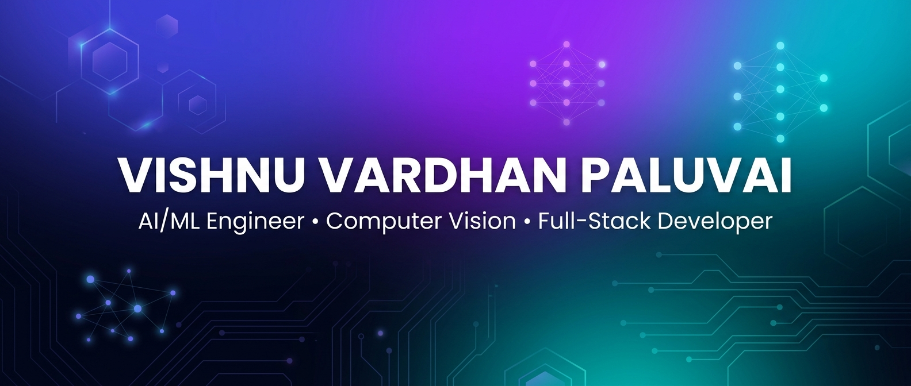

<!-- BANNER -->
<p align="center">
  
</p>

<!-- ANIMATED TYPING -->
<p align="center">
  <a href="https://git.io/typing-svg">
    
  </a>
</p>

<!-- PROFILE VIEWS & SOCIAL BADGES -->
<p align="center">
  <a href="https://github.com/paluvaivishnu">
    
  </a>
  &nbsp;
  <a href="https://github.com/paluvaivishnu?tab=followers">
    
  </a>
  &nbsp;
  <a href="https://github.com/paluvaivishnu?tab=repositories">
    
  </a>
</p>

---

##  &nbsp;About Me

```yaml
Name        : Vishnu Vardhan Paluvai
Role        : AI / ML Engineer
Education   : B.Tech CSE — AI & Machine Learning
University  : SRM University-AP, Amaravati
Mission     : LEARN • BUILD • INNOVATE
```


- 🔭 &nbsp;Currently building **AI-powered Computer Vision** applications
- 🧠 &nbsp;Specializing in **YOLO Object Detection** & **Real-Time Inference**
- 🎯 &nbsp;Passionate about **AI Application Development** & **Model Deployment**
- 💡 &nbsp;Experienced in **Full-Stack AI Development** with modern web stacks
- 📫 &nbsp;Reach me at **paluvaivishnu6@gmail.com**
- ⚡ &nbsp;Fun fact: I train AI models to see the world 👁️‍🗨️

<br clear="right"/>

---

## 🛠️ &nbsp;Tech Stack & Tools

### 💻 Programming Languages

<p>
  
  
  
  
  
</p>

### 🤖 AI & Machine Learning

<p>
  
  
  
  
  
  
  
  
</p>

### 📊 Data Science & Analytics

<p>
  
  
  
  
  
  
</p>

### 🌐 Full-Stack Development

<p>
  
  
  
  
  
  
  
  
</p>

### 🧰 Tools & Platforms

<p>
  
  
  
  
  
  
  
  
</p>

---

## 🚀 &nbsp;Featured Projects

<table>
<tr>
<td width="50%">

### 🎯 Bullseye AI
**AI-Powered Precision Target Scoring System**

<p>
  
  
  
  
</p>

> 🔹 Real-time target & impact/hole detection  
> 🔹 Automatic score calculation with AI  
> 🔹 Perspective transformation & image warping  
> 🔹 Browser-based ONNX inference engine  
> 🔹 Synthetic dataset generation pipeline  

<p>
  
</p>

</td>
<td width="50%">

### 🏛️ PrajaVaradhi
**Citizen Complaint Management System — Andhra Pradesh**

<p>
  
  
  
  
</p>

> 🔹 Citizen registration, login & complaint filing  
> 🔹 District-based administration system  
> 🔹 Priority & status tracking dashboard  
> 🔹 Government scheme & budget management  
> 🔹 Notifications, feedback & analytics  

<p>
  
</p>

</td>
</tr>

<tr>
<td width="50%">

### 💰 BidSphere
**Real-Time AI-Powered Live Auction Platform**

<p>
  
  
  
  
  
</p>

> 🔹 Live auctions with real-time bidding via Socket.IO  
> 🔹 Razorpay payment integration  
> 🔹 Twilio SMS notifications  
> 🔹 Gemini AI-powered chatbot  
> 🔹 Full user auth & auction management  

<p>
  
</p>

</td>
<td width="50%">

### ♻️ Waste Segregation AI
**AI-Based Waste Classification & Segregation Platform**

<p>
  
  
  
  
</p>

> 🔹 Real-time waste object detection  
> 🔹 Multi-category waste classification  
> 🔹 Automated segregation pipeline  
> 🔹 Detection data storage & database integration  
> 🔹 Analytics & reporting dashboard  

<p>
  
</p>

</td>
</tr>
</table>

---

## 🧠 &nbsp;Core Competencies

<table>
<tr>
<td align="center" width="25%">

**🤖 Machine Learning**
<br/>
<sub>Scikit-Learn • XGBoost<br/>Feature Engineering<br/>Predictive Modeling</sub>

</td>
<td align="center" width="25%">

**🧬 Deep Learning**
<br/>
<sub>Neural Networks<br/>Model Training & Evaluation<br/>Transfer Learning</sub>

</td>
<td align="center" width="25%">

**👁️ Computer Vision**
<br/>
<sub>YOLO11 • OpenCV<br/>Object Detection<br/>Image Processing</sub>

</td>
<td align="center" width="25%">

**🌐 Full-Stack AI**
<br/>
<sub>React • Node.js • MongoDB<br/>AI Integration<br/>Model Deployment</sub>

</td>
</tr>
</table>

<details>
<summary>🔍 <b>Expand: Detailed Skill Breakdown</b></summary>
<br/>

| Domain | Skills |
|--------|--------|
| **Machine Learning** | Scikit-Learn, XGBoost, Feature Engineering, Predictive Modeling, Model Evaluation |
| **Deep Learning** | YOLO, Neural Networks, Model Training, Transfer Learning |
| **Computer Vision** | OpenCV, YOLO11, Image Processing, Object Detection, Image Classification |
| **NLP** | NLTK, Hugging Face, Text Processing |
| **Data Science** | Pandas, NumPy, Matplotlib, Seaborn, EDA, Statistical Analysis |
| **Full-Stack** | React, Node.js, Express.js, MongoDB, MySQL, REST APIs |
| **AI Integration** | Gemini AI, ONNX Runtime, Browser-Based Inference, AI APIs |
| **DevOps & Deploy** | Git, GitHub, Vercel, Railway, ONNX |

</details>

---

## 📊 &nbsp;GitHub Analytics

<p align="center">
  <a href="https://github.com/paluvaivishnu">
    
    
  </a>
</p>

<p align="center">
  <a href="https://github.com/paluvaivishnu">
    
  </a>
</p>

<!-- ACTIVITY GRAPH -->
<p align="center">
  <a href="https://github.com/paluvaivishnu">
    
  </a>
</p>

---

## 🏆 &nbsp;GitHub Trophies

<p align="center">
  <a href="https://github.com/paluvaivishnu">
    
  </a>
</p>

---

## 🐍 &nbsp;Contribution Snake

<p align="center">
  <picture>
    <source media="(prefers-color-scheme: dark)" srcset="https://raw.githubusercontent.com/paluvaivishnu/paluvaivishnu/output/github-snake-dark.svg" />
    <source media="(prefers-color-scheme: light)" srcset="https://raw.githubusercontent.com/paluvaivishnu/paluvaivishnu/output/github-snake.svg" />
    
  </picture>
</p>

> 💡 **Note:** To enable the contribution snake, add the [Snake workflow](#-how-to-set-up-the-contribution-snake) GitHub Action to your profile repo.

---

## 📈 &nbsp;AI Performance Metrics

```
🔬 SYSTEM STATUS
━━━━━━━━━━━━━━━━━━━━━━━━━━━━━━━━━━━━━━━━━━━━━━━

  PROJECTS BUILT          ████████████████████   4+
  AI/ML PROJECTS          ███████████████████░   3+
  DATASET PREPARATION     ████████████████████   100%
  ANNOTATION              ██████████████████░░   90%
  MODEL TRAINING          █████████████████░░░   85%
  MODEL EVALUATION        ████████████████░░░░   80%
  DEPLOYMENT              ██████████████░░░░░░   70%

━━━━━━━━━━━━━━━━━━━━━━━━━━━━━━━━━━━━━━━━━━━━━━━

  [ AI CORE         : ● ACTIVE  ]
  [ COMPUTER VISION : ● RUNNING ]
  [ YOLO ENGINE     : ● ONLINE  ]
  [ DATA PIPELINE   : ● ONLINE  ]
  [ ONNX INFERENCE  : ● READY   ]
  [ API SERVICES    : ● ONLINE  ]
  [ DATABASE        : ● ACTIVE  ]

━━━━━━━━━━━━━━━━━━━━━━━━━━━━━━━━━━━━━━━━━━━━━━━
```

---

## 🌐 &nbsp;Connect With Me

<p align="center">
  <a href="https://www.linkedin.com/in/vishnu-paluvai-a8520b32b/">
    
  </a>
  &nbsp;&nbsp;
  <a href="mailto:paluvaivishnu6@gmail.com">
    
  </a>
  &nbsp;&nbsp;
  <a href="https://github.com/paluvaivishnu">
    
  </a>
</p>

---

<p align="center">
  
</p>

<p align="center">
  <b>⭐ From <a href="https://github.com/paluvaivishnu">Vishnu Vardhan Paluvai</a> — Building intelligent systems with AI, Computer Vision & Full-Stack technologies</b>
</p>

---

<!-- ─────────────────────────────────────────────────────── -->
<!-- 🐍 HOW TO SET UP THE CONTRIBUTION SNAKE                 -->
<!-- ─────────────────────────────────────────────────────── -->
<!--
## 🐍 How to Set Up the Contribution Snake

1. Create a file at `.github/workflows/snake.yml` in your profile repo
   (github.com/paluvaivishnu/paluvaivishnu) with the contents below.
2. The workflow runs daily and on push, generating SVG animations.
3. The snake images will be available at the paths referenced above.

```yaml
name: Generate Snake Animation

on:
  schedule:
    - cron: "0 0 * * *"   # runs daily at midnight UTC
  workflow_dispatch:        # allows manual trigger
  push:
    branches:
      - main

jobs:
  generate:
    runs-on: ubuntu-latest
    timeout-minutes: 10

    steps:
      - name: Generate Snake Game
        uses: Platane/snk/svg-only@v3
        with:
          github_user_name: paluvaivishnu
          outputs: |
            dist/github-snake.svg
            dist/github-snake-dark.svg?palette=github-dark

      - name: Push to output branch
        uses: crazy-max/ghaction-github-pages@v3.1.0
        with:
          target_branch: output
          build_dir: dist
        env:
          GITHUB_TOKEN: ${{ secrets.GITHUB_TOKEN }}
```
-->
